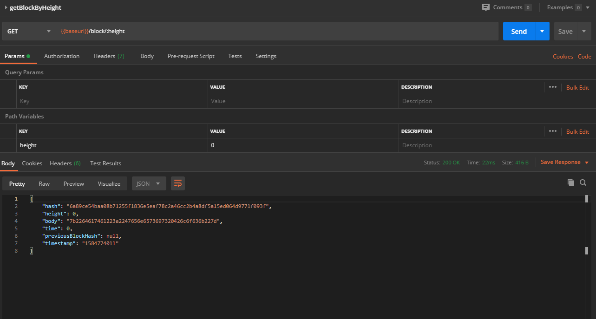
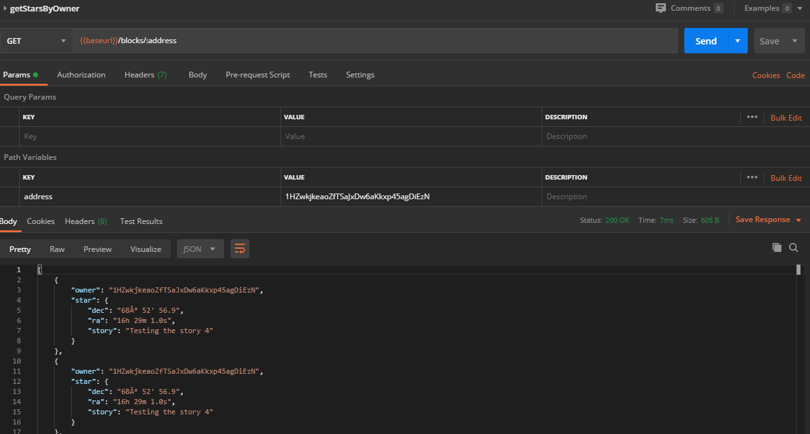
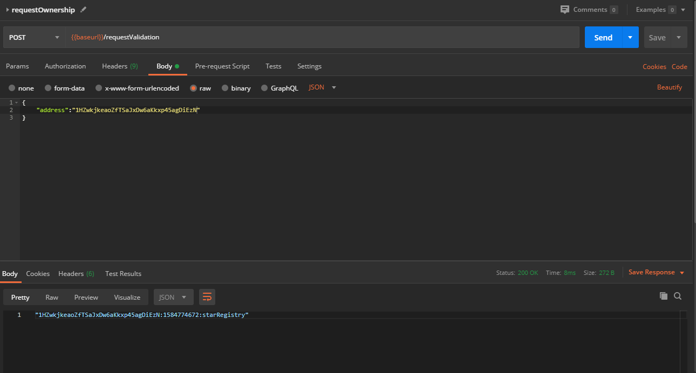
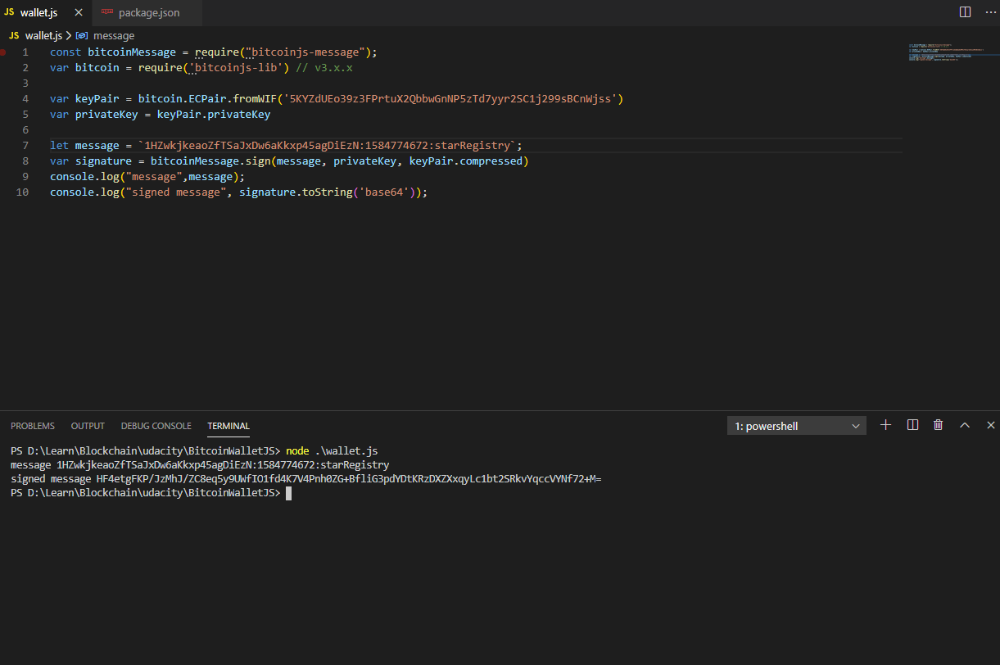
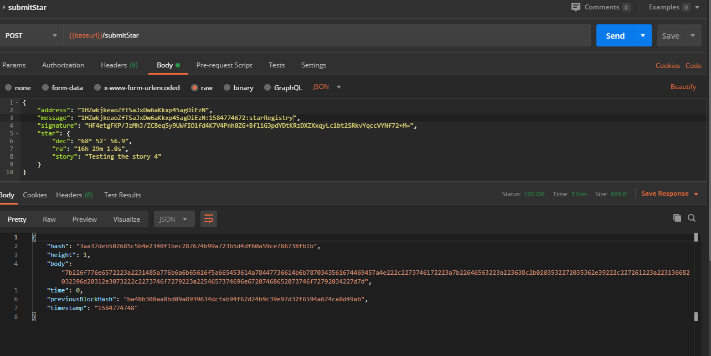

# Testing the App Functionality

According to the project requirements, the App has been tested with POSTMAN using the following values

- must use a GET call to request the Genesis block

- must use a POST call to requestValidation

- must sign message with your wallet

- must submit your Star

- must use GET call to retrieve starts owned by a particular address

